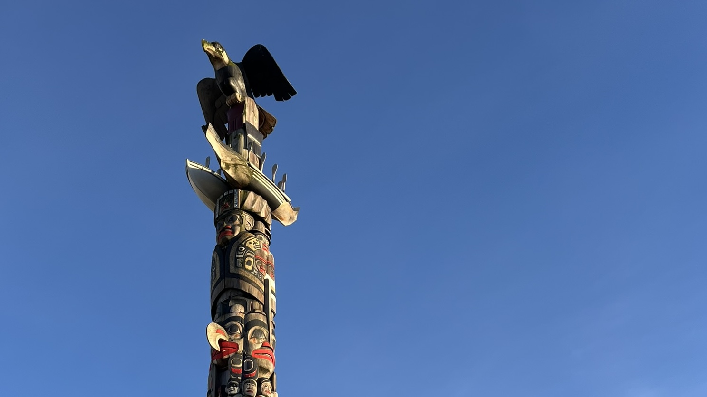
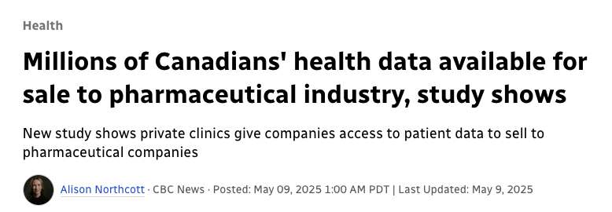

## Land Acknowledgement  {.nostretch}

We acknowledging that the land on which we gather is the traditional, ancestral, and unceded territory of the xwməθkwəy̓əm (Musqueam) People.\

{fig-align="center" width="500"}

Throughout this course, we will be weaving Indigenous topics into our "more typical" course material. I myself am a settler and am new to some of these topics. I am grateful for the opportunity to learn and grow with you.

## Classroom Policy

As stated in the syllabus, there is a **zero tolerance policy for disrespectful behaviour in this classroom**.

-   This includes within physical the classroom community (your peers, TAs, instructors, support staff) and online (discussion forums, social media). \

Some sensitive topics will be discussed throughout this course.

-   We are all learners and it is okay to make mistakes.

-   We will offer each other corrections politely, and I ask that you keep an open mind as we all continue to learn in this space.

This classroom is a safe space. [**You are welcome here.**]{.underline}

## Learning Outcomes:

By the end of this lecture, students are anticipated to be able to:

-   Define data management
-   Discuss how to handle sensitive data, including personal health data
-   Acknowledge the importance of treating Indigenous data as a type of sensitive data
-   Recall the principals of OCAP®
-   Identify studies where Indigenous Data Sovereighty and OCAP® are (and are not) respected

## Data Management

 

-   Data management refers to the way that data is *collected*, *used*, and *stored*.

-   In many cases, data contains sensitive information, such as personal identifying information (PII) like names, addresses, and birth dates, or sensitive health-related data.

     

    ::: callout-tip
    ## Discussion:

    -   Can you think of places where you might encounter such data?
    :::

## Data Management

-   Data involving PII and other sensitive information should be:

    -   Encrypted
    -   Only accessible by authorized users
    -   Anonymized (where possible)
    -   Used on a "need-to-know" basis
    -   Used **appropriately** and only for studies the person consented to

## Data Management: Health Data

{width="600"}

[Full News Article Link](https://www.cbc.ca/news/health/health-data-records-pharmaceutical-private-clinics-1.7529955#:~:text=The%20study%2C%20published%20in%20JAMA%20Network%20Open%2C,patient%20data%20flows%20between%20different%20private%20entities.)

## Data Management: Health Data

In most regions, health data is protected by privacy laws:\

-   **Personal Information Protection and Electronic Documents Act (PIPEDA)**: covers all personal data (financial, contact, health) in Canada

-   **Health Insurance Portability and Accountability Act (HIPAA)**: covers only health data in the United States of America

These acts establish standards for data protection and enforce how this sensitivity is to be handled. The previously mentioned strategies for handling personal identifying information (and more!) apply here.

## Data Management: Indigenous Data

-   Caution should be exercised when collecting, managing, storing, and/or analyzing data on Indigenous Peoples and their lands.

::: callout-note
## Definition

**Indigenous Peoples:** a collective name for the original peoples of North America and their descendants. The Canadian Constitution recognizes 3 groups of Indigenous peoples: First Nations, Inuit, and Métis. These are 3 distinct peoples with unique histories, languages, cultural practices and spiritual beliefs
:::

## Data Management: Indigenous Data

-   To many, data may be seen through a **colonial** context as something that, too, has been **taken** [@rodriguez_2016].

::: callout-note
## Definition

**Colonization**: the act of settling among and establishing control over Indigenous land and Peoples
:::

-   Data on Indigenous Peoples has also been used as a weapon against them to gain **control** over them by colonial settlers.

-   This has led to the idea of **Indigenous Data Sovereignty**.

## Indigenous Data: IDS

::: callout-note
## Definition

**Indigenous Data Sovereignty (IDS)**: the idea that Indigenous Peoples have the right to own and control how their data are collected, managed and used [@andersen_2025].
:::

-   Stems from Indigenous demands for the rights to their own data, and the harmful misuse of existing Indigenous data [@andersen_2025].

-   IDS is particularly relevant in the age of "open data", where issues relating to data consent, use, ownership, and storage have increased in complexity [@kukutai_2016].

## IDS in First Nations Communities

-   In Canada, the OCAP® (*ownership, control, access, posession*) principles are established for First Nations to assert data sovereignty.

::: incremental
-   **Ownership** refers to the relationship of First Nations to their cultural knowledge, data, and information.

-   **Control** affirms that First Nations, their communities, and representative bodies are within their rights to seek control over all aspects of research and information management processes that impact them.

-   **Access** refers to the fact that First Nations must have access to information and data about themselves and their communities regardless of where it is held.

-   **Possession** is the mechanism by which ownership can be asserted and protected.
:::

*Note: OCAP® is an expression of First Nations' jurisdiction over information about their communities. The principals of OCAP® are not an expression of all Indigenous communities.*

## Data on Indigenous Peoples: Discussion

::: callout-tip
## Discussion

Why might Indigenous Peoples want control over how their data is collected, stored, and used? Discuss in a small group
:::

::: incremental
-   Possible Answer:
    -   *While data can be used in a beneficial way for Indigenous communities, analyses using data on Indigenous Peoples often present with uncontrolled for biases as a result of colonization and a lack of understanding of Indigenous Peoples* [@kukutai_2016].
    -   *Such biases can be harmful to Indigenous Peoples*.
:::

## Asserting OCAP with Data Sharing Agreements

::: callout-note
## Definition

**Data Sharing Agreement**: a formal contract which ensures Indigenous Peoples are prioritized while working in partnership with non-Indigenous organizations (for example, researchers, universities, private organizations, or government).
:::

-   may involve a **data steward** who is responsible for receiving and maintaining the data under the agreement

Some considerations for agreements:

::: incremental
-   Who are the parties involved?
-   What type of data is being collected/stored/used? Which data will be shared?
-   What is the scope? Is this a one-time or a continued collection/storage/usage?
-   When will the agreement be terminated?
:::

## Reflection Activity

Read [this article](https://globalnews.ca/news/10318288/pictou-landing-first-nation-accuse-radiologists-secret-tests/) involving members of Pictou Landing First Nation in Nova Scotia, Canada.

The Mi'kmaq are the Indigenous Peoples who are native to Nova Scotia, New Brunswick, PEI, Newfoundland, and parts of Quebec and Maine.

::: callout-tip
## Discussion

Prepare to discuss the following questions in a small group:

-   What are some of your initial reactions/feelings to this article?
-   Was the researcher respecting the principles of OCAP throughout this study?
-   Is it really a "big deal" if extra scans were taken on select individuals?
:::

## Wrap up

-   Sensitive data must be handled carefully

    -   Includes, but is not limited to, personal health data

-   Data on and about Indigenous lands and Peoples should be used carefully, respecting the ideas of IDS

-   First Nations of Canada have a set of principals in place to assert IDS

## References
